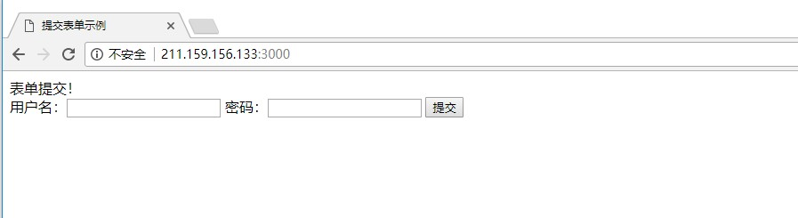
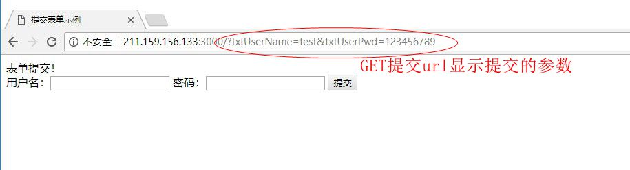
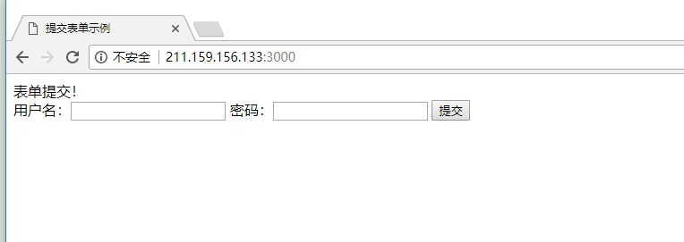
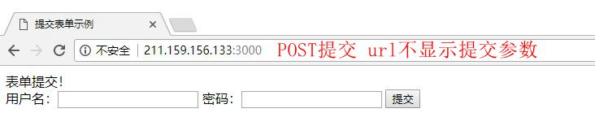

# from 表单提交

### GET方式

* html页面代码

```
<form>
用户名: <input type="text" id="txtusername" name="txtusername">

密码: <input type="password" id="xtuserpwd" name="txtuserpwd">

<input type="submit" value="提交">

</form>
``` 

* js接收参数并输出

```
var express = require('express');
var router = express.Router();

router.get('/',function(req,res){
	var username = req.query.txtusername,
	    userpwd = req.query.txtuserpwd,
   	    username2 = req.param('txtusername'),
	    userpwd2 = req.param('txtuserpwd');

	console.log('req.query用户名:'+username);
	console.log('req.query密码:'+userpwd);
	console.log('req.param用户名:'+username2);
	console.log('req.param密码:'+userpwd2);
	
	res.render('index',{ title: '提交表单示例'})；
})；

module.exports = router;

```



> 控制台输出

```
GET / 200 13.154 ms - 372
req.query用户名:test
req.query密码:123456789
req.param用户名:test
req.param密码:123456789
GET /?txtUserName=test&txtUserPwd=123456789 200 1.442 ms - 372

```




### POST方式

* html页面代码

```
<form method="post">
用户名: <input type="text" id="txtusername" name="txtusername">

密码: <input type="password" id="xtuserpwd" name="txtuserpwd">

<input type="submit" value="提交">

</form>
```

* js接收参数

```
var express = require('express');
var router = express.Router();

router.post('/',function(req,res){
        var username = req.body.txtusername,
            userpwd = req.body.txtuserpwd,
            username2 = req.param('txtusername'),
            userpwd2 = req.param('txtuserpwd');

        console.log('req.body用户名:'+username);
        console.log('req.body密码:'+userpwd);
        console.log('req.param用户名:'+username2);
        console.log('req.param密码:'+userpwd2);
        
        res.render('index',{ title: '提交表单示例'})；
})；

module.exports = router;


```



> 控制台输出

```
req.body用户名:test
req.body密码:123456789
req.param用户名:test
req.param密码:123456789
POST / 200 12.940 ms - 386

```



### GET和POST方式接收值

* req.query: 接收GET方式提交参数

* req.body:  接收POST提交的参数

* req.params: 两种都能接收到

request - [API]( http://expressjs.com/api.html#req.params)


**注意:req.body，Express处理这个post请求是通过中间件bodyParser**

```
...

var bodyParser = require('body-parser');

...

app.use(bodyParser.json());
app.use(bodyParser.urlencoded());

...

```

**没有这个中间件Express就不知道怎么处理这个请求，通过bodyParser中间件分析 application/x-www-form-urlencoded和application/json请求，并把变量存入req.body，这种我们才能够获取到！**

## 应用

### form包含的表单元素

```
<input > //简单的文本输入框

<textarea></textarea>  //多行文本输入

<button></button>   //按钮

<select></select>   //带选项的选择列表

<option></option>   //定义下拉列表中的一个选项,可以在不带有任何属性的情况下使用，但是您通常需要使用 value 属性，此属性会指示出被送往服务器的内容。**与<select>**标签配合使用

<optgroup></optgroup>  //把相关选项组合在一起，与<select>和<option>配合使用

<fieldset></fieldset>  //将表单内的相关元素分组,会在相关表单元素周围绘制边框。

<legend></legend>  //为 <fieldset> 元素定义标题。

<label></label>  //为 input 元素定义标注（标记）label 元素不会向用户呈现任何特殊效果。不过，它为鼠标用户改进了可用性。如果您在 label 元素内点击文本，就会触发此控件。就是说，当用户选择该标签时，浏览器就会自动将焦点转到和标签相关的表单控件上。<label> 标签的 for 属性应当与相关元素的 id 属性相同。

```
### 网页输入，实时显示输入结果

* html

```
<form id="form1">  
  <textarea id="name" name="name" type="text" oninput="display()">
  </textarea>
</form>
<div id="display">
</div>
```

* html-<script></script>

```
function display() {
//一
var name = document.getElementById("name").value;  
var display = document.getElementById("display");
display.innerHTML=name;

//二
name = form1.name.value;  
var display = document.getElementById("display");
display.innerHTML=name;

//三 jquery
name = $("#name").val();  
var display = document.getElementById("display");
display.innerHTML=name;

//四 jquery
name =  $("input[id='name']").val();  
var display = document.getElementById("display");
display.innerHTML=name;

//五 jquery

name = $("#name").attr("value");  
var display = document.getElementById("display");
display.innerHTML=name;

//六 jquery
name = $("input[id='name']").attr("value");  
var display = document.getElementById("display");
display.innerHTML=name;

}
```


