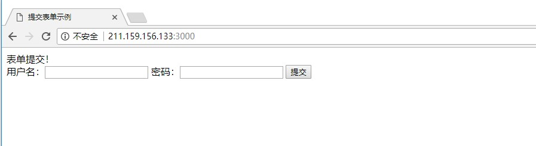
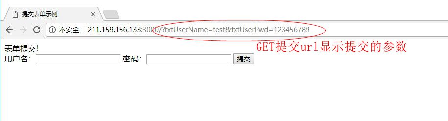
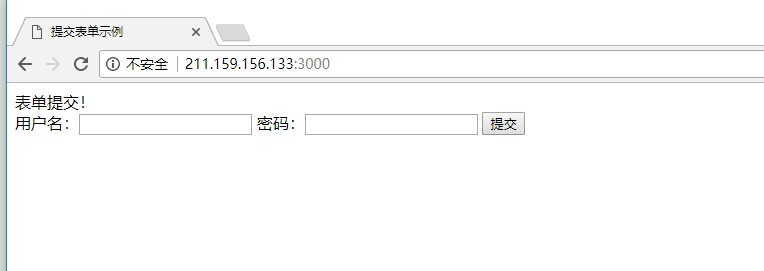
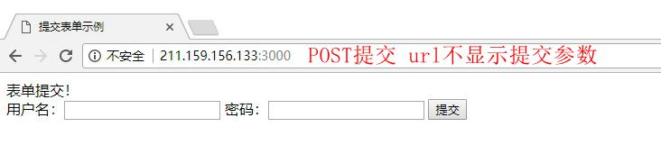

# from 表单提交

### GET方式

* html页面代码

```
<form>
用户名: <input type="text" id="txtusername" name="txtusername">

密码: <input type="password" id="xtuserpwd" name="txtuserpwd">

<input type="submit" value="提交">

</form>
``` 

* js接收参数并输出

```
var express = require('express');
var router = express.Router();

router.get('/',function(req,res){
	var username = req.query.txtusername,
	    userpwd = req.query.txtuserpwd,
   	    username2 = req.param('txtusername'),
	    userpwd2 = req.param('txtuserpwd');

	console.log('req.query用户名:'+username);
	console.log('req.query密码:'+userpwd);
	console.log('req.param用户名:'+username2);
	console.log('req.param密码:'+userpwd2);
	
	res.render('index',{ title: '提交表单示例'})；
})；

module.exports = router;

```



> 控制台输出

```
GET / 200 13.154 ms - 372
req.query用户名:test
req.query密码:123456789
req.param用户名:test
req.param密码:123456789
GET /?txtUserName=test&txtUserPwd=123456789 200 1.442 ms - 372

```




### POST方式

* html页面代码

```
<form method="post">
用户名: <input type="text" id="txtusername" name="txtusername">

密码: <input type="password" id="xtuserpwd" name="txtuserpwd">

<input type="submit" value="提交">

</form>
```

* js接收参数

```
var express = require('express');
var router = express.Router();

router.post('/',function(req,res){
        var username = req.body.txtusername,
            userpwd = req.body.txtuserpwd,
            username2 = req.param('txtusername'),
            userpwd2 = req.param('txtuserpwd');

        console.log('req.body用户名:'+username);
        console.log('req.body密码:'+userpwd);
        console.log('req.param用户名:'+username2);
        console.log('req.param密码:'+userpwd2);
        
        res.render('index',{ title: '提交表单示例'})；
})；

module.exports = router;


```



> 控制台输出

```
req.body用户名:test
req.body密码:123456789
req.param用户名:test
req.param密码:123456789
POST / 200 12.940 ms - 386

```



### GET和POST方式接收值

* req.query: 接收GET方式提交参数

* req.body:  接收POST提交的参数

* req.params: 两种都能接收到

request - [API]( http://expressjs.com/api.html#req.params)


**注意:req.body，Express处理这个post请求是通过中间件bodyParser**

```
...

var bodyParser = require('body-parser');

...

app.use(bodyParser.json());
app.use(bodyParser.urlencoded());

...

```

**没有这个中间件Express就不知道怎么处理这个请求，通过bodyParser中间件分析 application/x-www-form-urlencoded和application/json请求，并把变量存入req.body，这种我们才能够获取到！**


